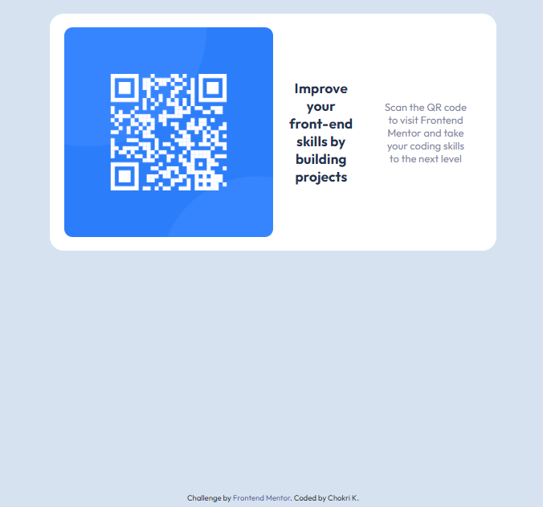

# Frontend Mentor - QR code component solution

This is a solution to the [QR code component challenge on Frontend Mentor](https://www.frontendmentor.io/challenges/qr-code-component-iux_sIO_H). Frontend Mentor challenges help you improve your coding skills by building realistic projects.

## Table of contents

- [Overview](#overview)
  - [Screenshot](#screenshot)
  - [Links](#links)
- [My process](#my-process)
  - [Built with](#built-with)
  - [What I learned](#what-i-learned)
  - [Continued development](#continued-development)
- [Author](#author)

## Overview

This challenge was to build a QR code component and get it looking as close to the design as possible. Users should be able to view the optimal layout depending on their device's screen size.

### Screenshot

### Links

- Solution URL: [Frontend Mentor | QR code component | Gherman Claudiu ](https://ghermanclaudiu.github.io/QRCode/)

## My process

### Built with

- Semantic HTML
- HTML classes and span
- Use of em/rem size
- CSS variables for colors
- Flexbox
- API for font-family Outfit
- Media Query

### What I learned

- html
- css
- MediaQuery

### Continued development

- Grid

## Author

- Github - [@GhermanClaudiu](https://github.com/GhermanClaudiu)
- Frontend Mentor - [@GhermanClaudiu](https://www.frontendmentor.io/profile/GhermanClaudiu)
